# Moving a Piano Through a Needle's Eye

**A weekend project: teaching one agent the puzzle that ants solve every day.**

---

## 1. First, watch the ants

<video src="assets/redvid_io_ants_solving_a_puzzle.mp4" controls width="720"></video>

▶ **[assets/redvid_io_ants_solving_a_puzzle.mp4](assets/redvid_io_ants_solving_a_puzzle.mp4)**
— 30 seconds, real ants, real maze.

A group of longhorn crazy ants is carrying a T-shaped load through a box. The
box has three rooms. Two walls divide them, and each wall has one narrow slit.
The load is wider than the slit.

Watch what they do. They push the load in with the **big head first**. They
turn it inside the middle room. Then they take it out **small head first**.

Nobody is in charge. No ant can see the whole maze. Each ant just pulls at the
point where it holds the load. The maneuver is what *comes out* of the group.

This is a real experiment: **Dreyer et al., PNAS 2025**, from Ofer Feinerman's
lab. They gave the same maze to ants and to groups of people. The interesting
result: ants get **better** in bigger groups. People get **worse**.

The puzzle itself is old and famous in robotics. It is called the
**piano-movers problem**: not "where do I go", but "in which order do I turn
and move". Anyone who has carried a sofa through a doorway knows it.

## 2. Try it yourself (2 minutes)

Reading about it is not the same as feeling it. So I built a small browser
sandbox of the exact same maze. No install, no Python.

```bash
git clone https://github.com/RezaKakooee/ant_swarm.git
# then open interactive/interactive_t.html in any browser
```

Controls: **left-drag** to move, **scroll** to rotate (it works while dragging),
**R** to reset. The T and the walls are rigid — you cannot cheat through them.

Two things to try:

1. **Take it through.** Big head into the first slit, turn inside the middle
   room, small head out of the second slit.
2. **Now try the other way**: small head into the first slit first. You will get
   stuck. That dead end is real, and it matters later in this story.

I did this myself before trusting any training run. Feeling the maze by hand is
the fastest way to understand why an agent struggles with it.

## 3. Why I did this

I saw the ant video and could not stop thinking about it. A few milligrams of
insect, no leader, no plan — and they solve a motion-planning problem that we
teach in robotics courses.

So I made it a fun project for my weekends. Not a lab project, no deadline.
Just one question:

> No single ant understands the maze. Can a learning agent discover the same
> maneuver on its own?

## 4. The plan: one agent first, many agents later

The real system is **multi-agent**: many ants, one load, no central brain. That
is the interesting scientific question, and it is where this project is going.

But it hides two hard problems inside each other:

1. **The maneuver** — the turn through two slits.
2. **The coordination** — many weak agents agreeing without talking.

Trying to learn both at once is a good way to learn nothing. So I split it:

- **Step 1 (this post): one agent.** Can a single controller do the maneuver?
- **Step 2 (next): many agents.** Can a group discover it together?

## 5. The environment

I built the maze as a standard gym (Gymnasium) environment, so any RL library
can plug into it.

### The simulator

The whole simulator is pure Python and NumPy, about a thousand lines. The ants'
world is flat, so it is a 2-D rigid-body simulation.

Every part of the T and every wall is a rectangle. Collision uses the exact
separating-axis test, so a collision is a real collision — not a grid
approximation. Rendering is plain NumPy pixels, so no display or graphics
library is needed on a compute node.

The gain is speed and honesty: thousands of steps per second, and geometry we
can trust down to a millimetre. That matters, because millimetres are exactly
what this task is about.

### The geometry (from the paper)

Sizes come from the paper's SI Table S1, plus measurements taken from the
experiment videos.

| Part                 | Size            |
| -------------------- | --------------- |
| Slit opening         | **0.150** |
| T big head           | **0.175** |
| T small head         | 0.087           |
| T total length       | 0.359           |
| Middle chamber depth | 0.221           |

Two numbers decide everything:

- The big head (**0.175**) is **wider than the slit** (**0.150**). You cannot
  push the T straight through. It must be tilted and threaded.
- The middle chamber (**0.221**) is **shorter than the T** (**0.359**). So you
  cannot freely spin the T inside the middle room either. The turn must use
  both slits as extra space.

Together they leave one family of solutions: **big head in → turn in the middle
→ small head out**. Exactly what the ants do.

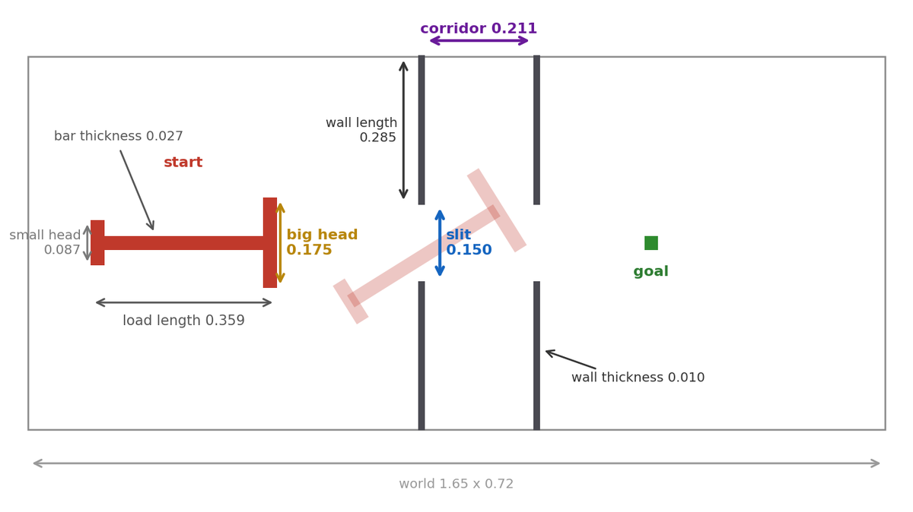

*The load at its start pose, and the same load tilted while threading the first
slit. The two arrows that matter: the big head is wider than the slit, and the
middle chamber is shorter than the load.*

### Action — two motion modes

**Kinematic** (simple, no physics): one command for the whole T.

```
action = [ direction ∈ [-π, π],  rotation ∈ [-1, 1] ]
```

Each step the T moves 0.01 along `direction` and turns `0.1 × rotation`. If the
move would hit a wall, it is rejected, so the T slides along the wall instead of
passing through it.

**Dynamic** (real physics, closest to the ants): each ant applies a **force**
at the point where it holds the load.

```
action per ant = [ push angle,  magnitude ]      (+ spin, for a single agent)
```

All forces are summed into one force and one torque, and the load moves as a
rigid body:

| Physics               | Value |
| --------------------- | ----- |
| Mass                  | 0.5   |
| Moment of inertia     | 0.01  |
| Linear friction       | 0.96  |
| Angular friction      | 0.94  |
| Substeps per env step | 10    |

This mode has **momentum**. The load drifts, overshoots, and bounces off walls.
It is much harder to control — and much closer to the real thing.

(One detail: a single agent sits at the centre of the stem, so its force alone
can never rotate the load. That is why it gets a third action, `spin`, which
applies torque directly.)

### Observation

Each ant sees 25 numbers:

| Block                        | Count | Meaning                            |
| ---------------------------- | ----- | ---------------------------------- |
| Attachment offset            | 2     | where this ant holds the load      |
| Load position                | 2     | where the T is                     |
| Goal vector                  | 2     | from the tracked point to the goal |
| Orientation                  | 2     | sin θ, cos θ                     |
| Angular velocity             | 1     | how fast it spins                  |
| Tip → slit-corner distances | 16    | 4 arm tips × 4 slit corners       |

That last block is a design decision worth explaining. Early policies never
rotated near the slit — because the walls were **not in the observation at
all**. The agent was blind to the thing it kept hitting. Those 16 distances go
to zero as an arm tip approaches a slit corner, which gives a sharp "I am about
to clip this corner" signal that the policy can react to.

### Reward

Simple to start with:

- **sparse**: `+1.0` when the load reaches the goal. Otherwise `0`.
- **shaped**: the same, plus `0.1 × (previous distance − current distance)`.

One important detail: distance is measured **from the centre of the big head**,
not from the middle of the T. Section 7 explains why — it closed a cheat.

### Network and algorithm

Deliberately ordinary. The difficulty here is not the model:

- **SAC** (Soft Actor-Critic): MLP policy, two hidden layers of 256, automatic
  entropy tuning. Off-policy, so it reuses every transition — which matters a
  lot when successes are rare.
- **PPO** as a comparison: 8 parallel environments, gSDE, entropy annealing.
- Discount 0.99, episodes capped at 500 steps.

In our runs SAC beat PPO by roughly **50× in sample efficiency**.

## 6. Experiment 1: just train it

With the environment ready, the honest first move is simply to train an agent
and see what happens.

**Random policy** — 0% success. The load wanders in the first room for all 500
steps, every episode.

**SAC and PPO with sparse reward** — still 0%. Nothing to learn from: the agent
never reaches the goal, so it never receives a single reward.

**So we tried shaped reward.** This is the standard fix: instead of rewarding
only the goal, reward getting closer to it. Now there is a signal at every step.

It did not work either. PPO trained for **14 million steps** and never solved
the maze once:

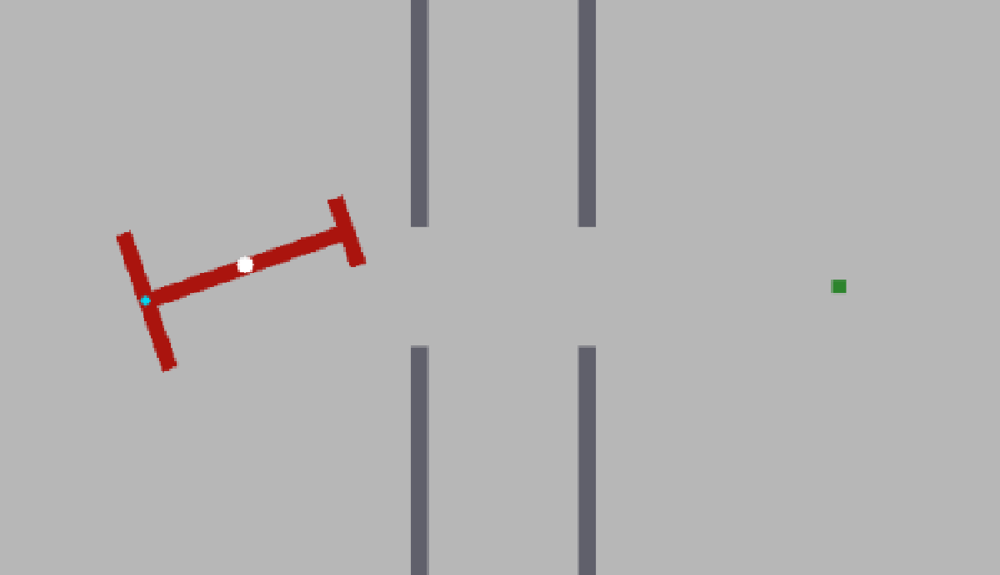

*PPO after 14 million steps. It learned exactly one thing: drive at the goal.
It pushes the load against the wall and stays there until the episode ends.*

We ran the variations. All of them failed:

| Run                                      | Steps  | Result       |
| ---------------------------------------- | ------ | ------------ |
| PPO dynamic, shaped reward               | 14.06M | 0%           |
| PPO dynamic, sparse reward               | 13.21M | 0%           |
| SAC dynamic, sparse reward               | 2.94M  | 0%           |
| SAC dynamic, geodesic reward (section 8) | 2.77M  | stuck at 60% |

Sadly, the simple approach does not solve this maze — not with sparse reward,
and not with shaped reward either.

## 7. Why it failed

Four separate reasons. Each one needed its own fix.

### (a) The reward is sparse

The agent is only paid when it **finishes**. Before that, every state looks the
same: reward 0. There is no hill to climb.

### (b) The space of solutions is tiny

We measured this instead of guessing. We built the space of all possible poses
of the load — position x, position y, and angle θ — on a fine grid, and marked
which ones are collision-free:

- Only about **30%** of all poses are legal at all.
- The passage through a slit is a **thin diagonal channel** in that space.
- Its clearance is about **2.5 mm**. Make the walls 3 mm thicker and the maze
  becomes **impossible**.

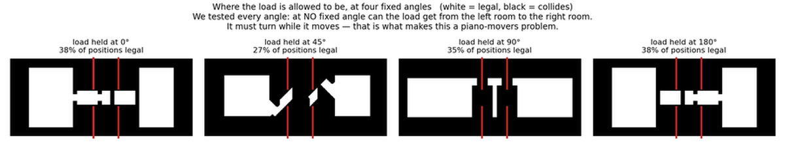

*Each panel fixes the load's angle and shows where its centre may sit: white is
legal, black collides. We tested every angle — at **no fixed angle** can the
load get from the left room to the right room. Turning is not an optimisation
here; it is the only way through.*

So random exploration has to find a channel a few millimetres wide, in a 3-D
space, by luck — and then follow it in the right order for about 150 steps. It
never happens. This is an **exploration bottleneck**.

### (c) The shaped reward actually lies

This is the part that surprised me most, and it explains the 14-million-step
failure above.

Straight-line distance to the goal points **through the wall**. The correct
maneuver — tilting the load, backing up, lining the big head up with the slit —
*increases* the straight-line distance. So the shaped reward **punishes the
correct move** and rewards driving into the wall.

The reward is not weak. It is **deceptive**. Adding more of it makes things
worse.

### (d) The agent found a cheat

Our first "successful" runs were a trap. With distance measured from the middle
of the T, the agent learned to poke the **small head** through the slits,
because the small head fits anywhere. It scored well while never doing the real
maneuver.

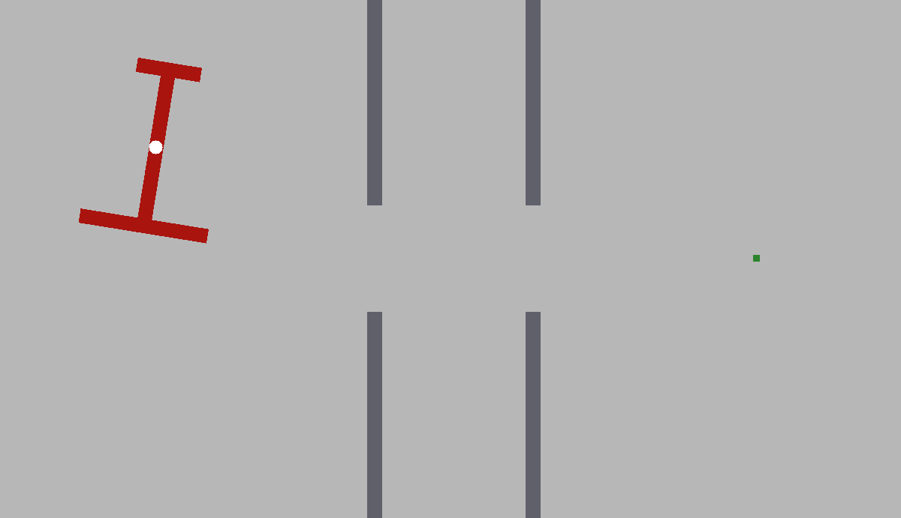

*A "94% success" policy from that era, at the full narrow gap. Look at which
end leads: the small head goes first through both slits, and the big head never
enters. The load simply slides through sideways. We checked the last 12
solutions of that run — 12 out of 12 did this. The score was real; the
behaviour was not what we wanted.*

**Fix:** measure the distance from the **centre of the big head**. Now the big
head has to arrive at the goal, so leading with the small end earns nothing. The
cheat vanished — and the success rate honestly dropped back to 0%.

## 8. So we need a curriculum — and a curriculum needs a teacher

The diagnosis is clear: the agent cannot *find* the solution by itself. So we
must help it practise. That is a **curriculum**: train on easy versions first,
then harder ones.

But that raises two questions, and both have to be answered well.

### Question 1: what is the strategy? What do we make easier?

The obvious idea is to **widen the slit** and slowly narrow it. We tried it. It
is a trap.

> A wider slit is not "the same task, but easier". It is a **different task**
> with **different solutions**: when the slit is wide, the small-head-first
> trick works. The agent learns that trick, and when the slit narrows again the
> trick becomes useless. The learned skill does not transfer. This is called
> **negative transfer**, and we measured it.

The rule we settled on:

> **Never change the maze in a way that changes which solutions exist. Change
> where the episode starts instead.**

So: keep the maze at full difficulty, and move the **starting position**.

1. Start the load almost at the goal — success is easy, and the agent finally
   sees a reward.
2. When it succeeds often enough, move the start one step backwards.
3. Repeat until the start is the real start.

Evaluation always uses the true full task, so the numbers never flatter us.

This alone solved the **kinematic** maze (the version without momentum):

| First success (step 1,403)                                                                                          | After mastery (step 421,814)                                                                                         |
| ------------------------------------------------------------------------------------------------------------------- | -------------------------------------------------------------------------------------------------------------------- |
| 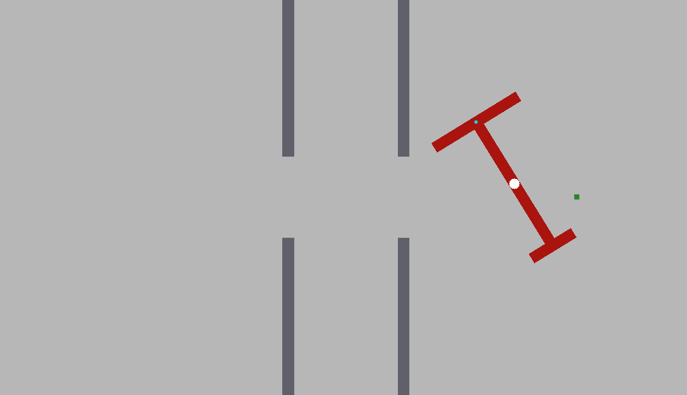 | 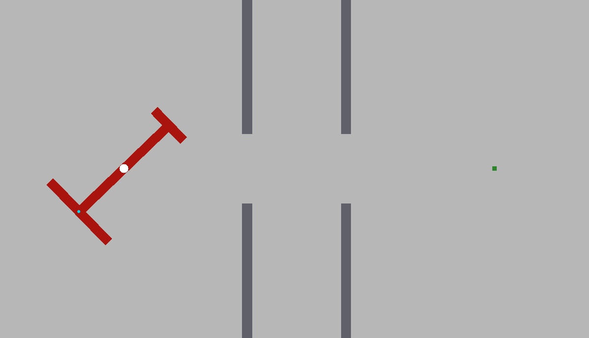 |
| Lucky wandering, 403 steps, started right next to the goal                                                          | The real task, from the real start, 79 steps — near optimal                                                         |

SAC reached 99% success in **422k steps**. Real progress. But the dynamic
version — the one with momentum, the one that matters — still failed.

### Question 2: who is the teacher?

Moving the start backwards sounds simple, but it hides a hard question:
**backwards along what?**

We were placing the load at a random spot inside a band and hoping it was
useful. Many of those starts were useless: impossible poses, or poses already
touching a wall. The agent was practising positions that are not on the way to
anything.

To do better, we need something that actually **knows the maze**: where the
route is, and how far each pose is from the goal along that route.

That something is our teacher: **BFS**.

**BFS** (breadth-first search) is one of the oldest algorithms in computer
science. It explores a graph layer by layer, like a wave spreading out, and it
finds the shortest path from a start to everywhere else.

Our graph is the pose space from section 7(b): every cell is a pose (x, y, θ),
and two poses are neighbours if one small move or one small rotation connects
them — **through free space only**. We run the wave from the **goal**.

When the wave stops, every legal pose carries a number: *how many small legal
moves it takes to reach the goal from here.*

That one computation — a few seconds, done once — gives us three things:

1. **Proof** that the maze is solvable at all (the wave reaches the start).
2. **A reward that tells the truth** (section 9).
3. **Curriculum stages that lie on the real route** (section 10).

## 9. The teacher's first gift: a reward that tells the truth

The shaped reward failed because it used the **wrong distance**. Straight-line
distance goes through walls. The load cannot.

So we replaced it with the distance the BFS teacher measured — the distance
**along the real route**. This is called a **geodesic** distance.

```
reward  =  field(previous pose)  −  field(new pose)      + success bonus
```

Think of a car navigation system. It never shows the straight-line distance to
your destination; it shows the driving distance. When you drive away from your
destination to reach a motorway entrance, the straight-line distance goes up,
but the driving distance goes **down** — because you are making real progress.

Now the reward is honest:

- Turning in place to line up the big head → the route number **drops** →
  positive reward. **Turning counts as progress.**
- Backing away from the goal to get the angle right → still rewarded, if it is
  on the route.
- Poking the small head into the dead end → the route number **jumps up** →
  negative reward. **The trap punishes itself.**

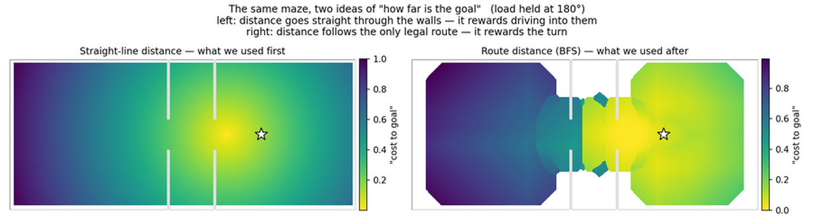

*The same maze, two ideas of "how far is the goal". On the left the colour
flows smoothly through the walls, as if they were not there — that is the
reward that failed. On the right the whole left room is far away, and the
value only improves through the slit — that is the reward that worked.*

And it is safe: this is potential-based shaping, which provably cannot change
which policy is best. It only makes the good one easier to find.

On the kinematic maze it beat sparse reward by about 25% (322k steps vs 411k).

**An honest caveat.** Even with correct geometry, the kinematic policy found a
legal but unwanted trick: poke the small head in, then pirouette inside the
slit. In the real experiment the transparent covers prevent this.

| The maneuver we want                                                                                                   | The trick the agent found                                                                                               |
| ---------------------------------------------------------------------------------------------------------------------- | ----------------------------------------------------------------------------------------------------------------------- |
| 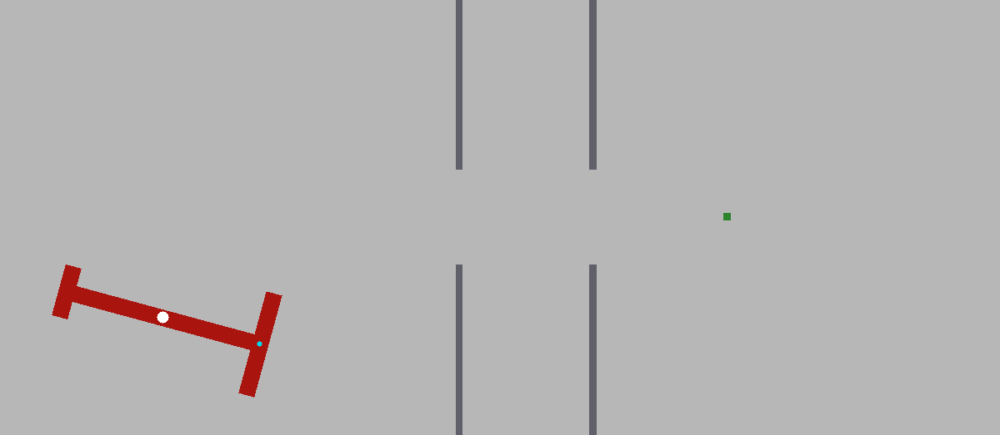 | 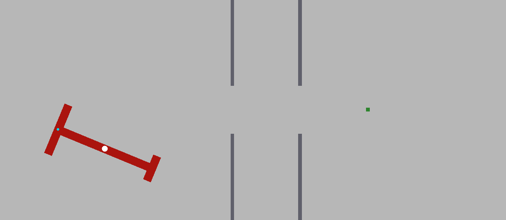 |
| Big head enters, turn in the middle, small head exits                                                                  | Small head pokes in, then spins inside the slit                                                                         |

Setting the slit to the exact paper value (0.150) reduced this from about half
of all solutions to about a third. The last three changes removed it entirely.

## 10. The teacher's second gift, and two more fixes

Kinematic was solved. Dynamic — real forces, real momentum — was not. Three
changes finished it.

### (a) Curriculum stages placed on the true route

We already had the BFS route. So we used it a second time: take **16 points
along the real solution path** and make those the curriculum stages.

Now every stage starts the load **exactly on the correct route**, just further
back than the stage before. No more useless random poses. And a stage advances
**only** when the agent truly masters it (90% success over 100 episodes) —
never because time ran out.

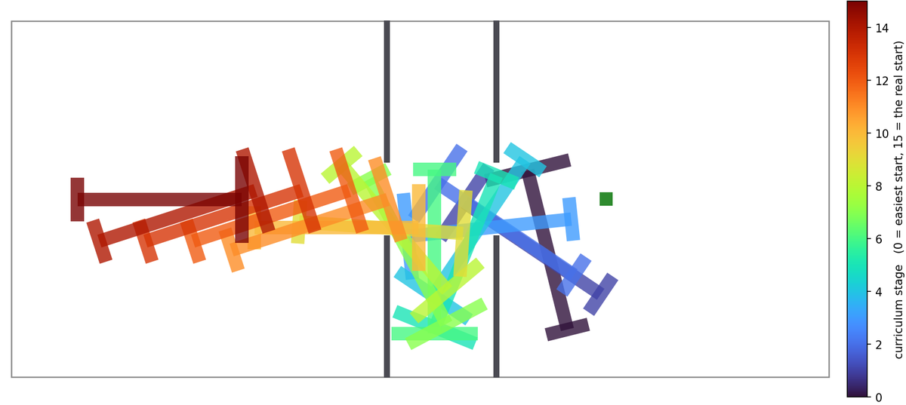

*The 16 training stages, drawn as the load itself. Read it from dark blue
(stage 0, almost at the goal) to dark red (stage 15, the real start) and you
are reading the solution backwards — including the turn in the middle room.
The agent practises this sequence in reverse order.*

This is also what finally killed the pirouette: the agent only ever practises
the canonical route, so that is the maneuver it learns.

### (b) Do not forget the rare win

SAC learns from a big pool of past experience. Wins through the slit are rare,
so they drown in that pool and get forgotten.

Fix: keep successful episodes in a **separate** pool, and force **25% of every
training batch** to come from it. In plain words: the agent is not allowed to
forget how it got through the slit.

### (c) Let the agent feel its own speed

With momentum, the load slides and drifts. But the observation contained
position and angle — **not speed**. That is like driving while seeing where you
are, but not how fast you are moving.

We added linear velocity (vx, vy). The observation went from 25 to 27 numbers,
and the policy could finally brake and correct for drift.

## 11. Result

**100% success, mastered at 247,519 steps** — about two hours on one machine,
and **56× fewer steps** than the 14-million-step run that learned nothing.

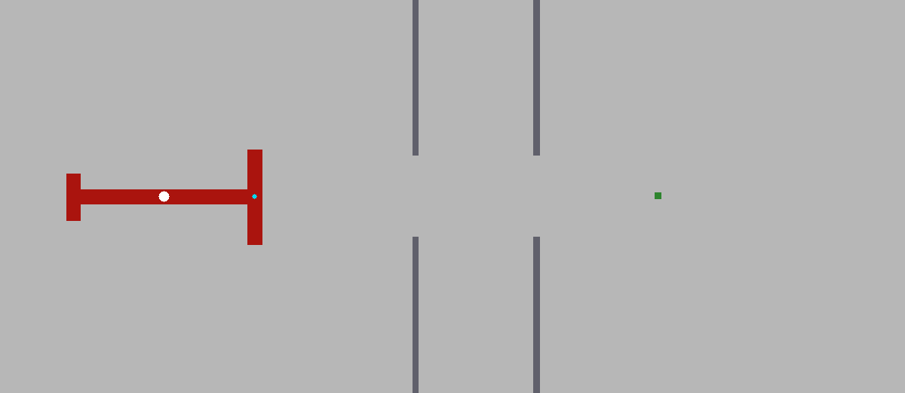

*One evaluation episode, from the real start pose: big head into the first
slit, turn in the middle room, small head out of the second. 153 steps. Four
more episodes were run and all of them look like this one.*

Then the real test. A score of 100% is not enough — we wanted to know **what**
the agent actually does. So we replayed the last 25 saved solutions and measured
which head crosses each slit first:

```
which head crosses SLIT 1 first :  BIG    25 / 25
which head crosses SLIT 2 first :  small  25 / 25
```

**Every single solution uses the ants' maneuver.** Big head in, turn in the
middle room, small head out. No shortcuts, in real physics.

|                         | Value        |
| ----------------------- | ------------ |
| Success (deterministic) | 100% (5 / 5) |
| Success (stochastic)    | 100% (3 / 3) |
| Steps to master         | 247,519      |
| Episode length          | ~153 steps   |
| Canonical maneuver      | 25 / 25      |

Here is the whole journey in one picture — every experiment we ran:

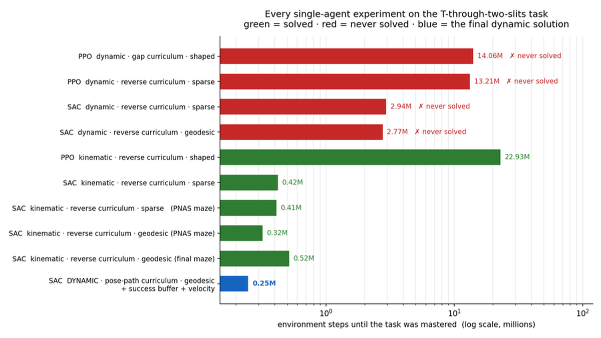

*Red bars never solved the maze, no matter how long they ran. The blue bar is
the final dynamic solution: the smallest bar on the chart.*

## 12. What I would tell my past self

1. **Do not make the environment easier if that changes the solution.** Wider
   slits taught a trick that does not transfer. Move the *start*, not the walls.
2. **A dense reward only helps if it points the right way.** Straight-line
   distance was worse than no reward at all. Route distance fixed it.
3. **Measure your solution space before blaming your algorithm.** "A 2.5 mm
   channel in a 3-D pose space" explains the failures better than any
   hyperparameter sweep.
4. **Check what the agent did, not just its score.** Two of our "successes"
   were cheats. Replay the trajectories and look.
5. **A good teacher pays three times.** One BFS gave us the proof, the reward,
   and the curriculum.
6. **If the physics has memory, the observation needs it too.** Momentum
   without velocity in the observation is hidden state.

## 13. Next: back to the ants

Single agent is done, in both motion modes. Now the interesting part starts:
**many agents, one load**.

First a central controller for several ants. Then the real thing —
parameter-shared decentralized policies, where each ant sees only its own local
view and feels the others only through the load it is holding. That is the
setting the real ants live in, and the question this project was always about:

> How does a group with no leader and no plan discover a maneuver that none of
> its members understands?

---

*Code, environment, configs, and every run shown here:
[github.com/RezaKakooee/ant_swarm](https://github.com/RezaKakooee/ant_swarm)*

*Reference: Dreyer, T. et al., "Comparing cooperative geometric puzzle solving
in ants versus humans", PNAS 2025.*
