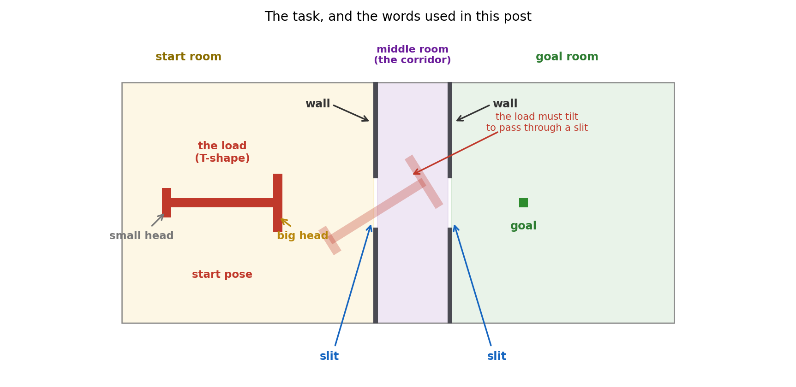
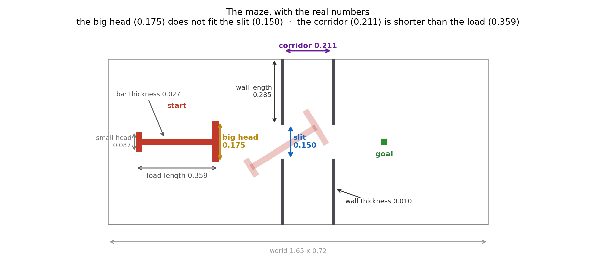

# Can an AI agent solve the puzzle that ants solve?

## 1. The ants

I'm sure many of you have seen this video, showing a group of ants carrying a
T-shaped load through a box.

It is amazing to see how a few milligrams of insect, with no leader and no plan,
solve a motion-planning problem that we teach in robotics courses.

So I asked myself: can AI agents do the same?

<video src="redvid_io_ants_solving_a_puzzle.mp4" controls width="720"></video>

▶ [redvid_io_ants_solving_a_puzzle.mp4](redvid_io_ants_solving_a_puzzle.mp4)

There might already be some works implementing this task. I did not even search
about it, because I wanted to do it myself — I was sure I would learn a lot
along the way.

## 2. The environment

So I rebuilt the maze as a gym environment, to see if RL agents can learn the
same maneuver or not.

The real system is multi-agent, and that is where this task gets even more
interesting, because the research behind this video [**Dreyer et al., PNAS
2025**] shows that ants get **better** in bigger groups. People get **worse!**

However, I started with a single agent, which should be easier for RL.

The environment is a small 2-D rigid-body simulator in pure NumPy,
with exact rectangle collisions.



A single agent either moves the load directly (*kinematic*) or pushes it with real
forces and momentum (*dynamic*, the mode closest to the ants).

## 3. Try it yourself

If you want to try how this env works, I also built a simple but interactive
version of it here:

```bash
git clone https://github.com/RezaKakooee/ant_swarm.git
# then open interactive/interactive_t.html in any browser
```

Left-drag to move the load, scroll to rotate it, **R** to reset.

Feeling the maze by hand is the fastest way to understand why an agent
struggles with it.

## 4. Now let's see how the env components are defined

**Observation.** Instead of giving the agent an image of the maze, I took the observation simple, as a collection of features — 25 numbers in total:

| Block                        | Count | Meaning                       |
| ---------------------------- | ----- | ----------------------------- |
| Attachment offset            | 2     | where this ant holds the load |
| Load position                | 2     | where the T is                |
| Goal vector                  | 2     | from the load to the goal     |
| Orientation                  | 2     | sin θ, cos θ                |
| Angular velocity             | 1     | how fast it spins             |
| Tip → slit-corner distances | 16    | 4 arm tips × 4 slit corners  |

The last block matters. Without it the agent has no idea where the walls are,
so it cannot know that it is about to hit one. And I did not want an image,
because then the agent would first have to learn to *see*. The hard part here
is not seeing, it is control.

**Action.** I implemented two versions. In kinematic mode the action is two
numbers: a direction to move in, and how much to rotate.

```
action = [ direction in [-pi, pi],  rotation in [-1, 1] ]
```

Each step the load moves 0.01 along `direction` and turns `0.1 * rotation`.
There is no mass and no momentum — the load simply moves.

In dynamic mode the agent pushes instead:

```
action per ant = [ push angle,  magnitude ]      (+ spin, for a single agent)
```

Having physics is even more interesting, and much closer to the ants: the load
has mass, it drifts, it overshoots. (The spin is there because a single agent
sits in the middle of the load, and pushing from the middle can never turn it.)

| Physics               | Value |
| --------------------- | ----- |
| Mass                  | 0.5   |
| Moment of inertia     | 0.01  |
| Linear friction       | 0.96  |
| Angular friction      | 0.94  |
| Substeps per env step | 10    |

**Reward.** For now I kept it as simple as possible: **+1 when the load reaches
the goal, and 0 everywhere else**. Nothing for getting closer, nothing for
trying. An episode ends after 500 steps if the agent did not make it.

## 5. The agent

For the RL agent I picked two algorithms: **PPO**, which is on-policy, and
**SAC**, which is off-policy. I wanted to see both.

The network is as simple as it gets: an MLP. Both algorithms are actor-critic,
so one part picks the action and another part judges it. They are two separate
small networks: PPO uses 64x64 for each, SAC uses 256x256. (SAC actually keeps
two critics instead of one)

Nothing special. No vision, no memory. If this task turns out to be hard, it
should not be because of the model.

## 6. Experiment 1: make it easy first

My first idea was the obvious one: start with a **wide** slit, and make it
narrower step by step as the agent gets better.

It worked. The agent passed every stage and reached the real narrow width.

Then I looked at what it actually does:


It never does the maneuver. It slides the load through sideways, **small head
first**. The small head fits everywhere, so that is what the agent learned in
the wide stages — and it kept doing it. My reward did not complain, because I
only asked for the centre of the load to reach the goal.

So by widening the slit I did not make the task easier. I made it a
**different** task, with a solution the real task does not have.

## 7. Experiment 2: narrow slit, and ask for the big head

I narrowed the slit to make the task harder. And to encourage the agent to go
with the big head, I changed what counts as success: now the **big head** has
to arrive at the goal, not the place where the agent sits.

Now the agent has to do the real maneuver. But both PPO and SAC failed to learn
the task:

| Run                        | Steps  | Success |
| -------------------------- | ------ | ------- |
| PPO dynamic, sparse reward | 13.21M | 0%      |
| SAC dynamic, sparse reward | 2.94M  | 0%      |

### Why did it fail?

My first guess was the **sparse reward**. The agent is only paid when it
finishes. Before that, every state looks the same: reward 0. There is nothing
to climb, so there is nothing to learn from.

So I added a shaped reward: a small reward for every step that brings the load
closer to the goal. Now there is a signal everywhere, not only at the end.

It failed again:

| Run                        | Steps  | Success |
| -------------------------- | ------ | ------- |
| PPO dynamic, shaped reward | 14.06M | 0%      |


After 14 million steps it has learned exactly one thing: drive at the goal. It
pushes the load against the wall and waits there until the episode ends.

So the sparse reward was not the whole story. My second guess: **the space of
solutions is too tiny.** Most poses of the load are not even legal — the load
is inside a wall. To pass a slit it has to be in the right place *and* at the
right angle at the same time, and very few poses satisfy both. How tight is it?
If I make the walls 3 mm thicker, the maze has no solution at all. Random
exploration does not find something like this.

## 8. Experiment 3: a curriculum

If the agent cannot find the solution by itself, it has to practise. It needs a
curriculum.

The two simple ways to build curriculum are:

**1. Widen the slit** and narrow it step by step. But in
Experiment 1 we saw that this teaches the agent to cheat.

**2. Cut the task into pieces.** Let it first learn to reach the goal from
inside the goal room. Then from inside the corridor. Then from around the real
start. And finally stitch the pieces together, so it can do the whole thing.

The maze never changes here — only where the episode begins:

| 1. start in the goal room                                                                                       | 2. start in the corridor                                                                                         | 3. start at the real start                                                                                       |
| --------------------------------------------------------------------------------------------------------------- | ---------------------------------------------------------------------------------------------------------------- | ---------------------------------------------------------------------------------------------------------------- |
|  |  |  |
| easy — even a clumsy policy stumbles into the goal                                                             | the hard part: the turn between the two slits                                                                    | the whole task, from the real start                                                                              |

Then I ran SAC, and it was successful.

But when I looked closely, it was still cheating.

My first thought was that my arena was to blame — I had drawn it by hand, not
from the paper. So I rebuilt the maze with the real numbers:



It did not help. In the new maze the agent went in small head first again — all
20 solutions I checked.


Two things were wrong. My slit is still a bit too generous — in the paper it is
0.81 of the big head, in mine 0.86 — so this shortcut stays open. And my
curriculum dropped the load at a **random place and a random angle**, so nothing
ever asked it to reach the slit with the big head in front.

The stages were mine. They were not taken from a real solution of the maze.


## 9. Experiment 4: give the agent a teacher

At this point the agent had two problems. It did not know which moves were real progress, and my curriculum did not know which starting poses were useful.

So I decided to give it a teacher. Not a teacher that tells it exactly what action to take, but one that already knows a real route through the maze.

For that, I needed a map of every situation the load can be in. Here a "situation" is not only its position. Its angle matters too: the load can fit at one angle and hit a wall at another, even when its centre is in the same place. So each point on this map is a full pose: x, y, and angle.

Then I used BFS, or breadth-first search. You can think of it as flooding this map backwards from the goal. The flood can move from one pose to another only when that small move is legal and does not cross a wall.

When the flood is finished, every reachable pose has a number. The number says how many small legal moves are left before the goal. A pose with distance 100 is closer than one with distance 101, even if the straight-line distance says otherwise.

This one map gave me both things I was missing.

Which way is forward: a better reward. My old reward used the straight-line distance to the goal. But the straight line goes through the walls. That is why the agent was rewarded for pushing against a wall. It was also punished for turning away from the goal, even though that turn is exactly what solves the maze.

The BFS distance follows the real route instead. If turning the load brings it from distance 101 to 100, the agent gets a reward. If pushing the small head into a dead end makes the distance larger, the agent loses reward. Now the reward points around the walls, not through them.

Where to practise: stages from a real solution. BFS also gives me a valid path from the start to the goal. I picked 16 poses along that path and used them as the curriculum stages.

The 16 curriculum stages

Read the colours from dark blue to dark red. Stage 0 is almost at the goal, and stage 15 is the real start. In other words, the picture shows the solution backwards, including the important turn between the two slits.

The agent learns it in the same order: first the last piece, then the piece before it, and so on. It moves to the next stage only after reaching 90% success. Time alone is never enough.

## 10. Two last fixes, and the result

With the teacher in place I moved to the hard mode: **dynamic**, with real
forces and momentum. Two more things were needed there.

**Do not forget the rare win.** SAC learns from a big pool of past experience.
Wins through the slit are rare, so they drown in that pool and get forgotten. So
I keep successful episodes in a second pool, and force 25% of every training
batch to come from it.

**Let the agent feel its own speed.** With momentum the load drifts and
overshoots, but my observation only had position and angle — not speed. That is
like driving while you can see where you are, but not how fast you are moving.
Adding the velocity took the observation from 25 numbers to 27.

Then it worked. **100% success, learned in 247,519 steps** — about two hours on
one machine, and 56 times fewer steps than the 14-million-step run that learned
nothing.


But the number I actually cared about was not the success rate. It was *how* it
solves the maze. So I replayed the last 25 solutions and checked which head goes
through each slit first:

```
slit 1 entered first by :  BIG head    25 / 25
slit 2 exited  first by :  small head  25 / 25
```

Every single one. Big head into the first slit, turn in the corridor, small head
out of the second — the same maneuver as the ants, in real physics, with no
shortcuts.

## 11. What is next

One agent can now do it. But one agent is not what the ants do.

The next step is **many agents on the same load**. Each one pushes at its own
point, sees only its own local view, and feels the others only through the load
it is holding. No leader, no plan, no messages — the same setting the ants are
in. That is the part I am really curious about: whether a group can find this
maneuver together, and whether it gets better with more agents, as the ants do
and people do not.

There is also plenty left to improve in what already exists. My slit is still a
bit wider than the paper's. The teacher is a strong crutch — I would like to see
how far one can get with a weaker one. And nobody has tried PPO with the teacher
setup yet.

## Come and play with it

The code is on GitHub, and it is open:

**[github.com/RezaKakooee/ant_swarm](https://github.com/RezaKakooee/ant_swarm)**

It is a normal gym environment, so you can drop your own algorithm on it in a
few lines. Everything in this post — the maze, the configs, the curriculum, the
BFS teacher — is in there, and the browser sandbox needs no install at all.

If you find a better way, break something, or make the agent cheat in a way I
did not think of, I would love to hear about it. Open an issue, send a pull
request, or just write to me. And if you work on collective behaviour or
multi-agent RL and this is close to your area, please get in touch — I would
enjoy the conversation.
