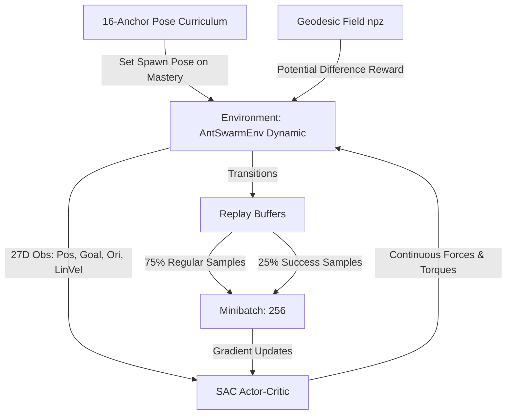

# Experiment Analysis & Technical Report: Dynamic PNAS Piano-Movers (v2)

**Experiment Identifier**: [`ant__20260814_1230__local-1427853__train_sac__pnas_dyn_geo_v2`](file:///home/azureuser/ant_swarm/storage_local/ant__20260814_1230__local-1427853__train_sac__pnas_dyn_geo_v2)  
**Task**: Single-agent dynamic piano-movers problem (Dreyer et al., PNAS 2025 replica).  
**Status**: **MASTERED (100% Full-Task Success Rate)** at step 247,519.

---

## 1. Executive Summary

This experiment solved the continuous dynamic maze-navigation problem where an ant must push a large T-shaped object through two narrow slits with a middle turning chamber.

```
       ┌───────────────────────────┐
       │   Wall 1         Wall 2   │
       │    │               │      │
Start  │    │    Chamber    │      │  Goal
[T] ───┼─►  ▼               ▼  ───┼─► (X)
(x=0.3)│  Slit 1          Slit 2   │ (x=1.2)
       │ (Enter BIG)   (Exit SMALL)│
       └───────────────────────────┘
```

The load must enter the first slit **big-head-first**, rotate $180^\circ$ inside the narrow chamber, and exit the second slit **small-head-first**.


---

## 2. Core Method & Learning Architecture



### Algorithm: Soft Actor-Critic (SAC) + Success Replay Buffer
- **Base Algorithm**: Off-policy Soft Actor-Critic ([`train_sac.py`](file:///home/azureuser/ant_swarm/scripts/rl/train_sac.py)) with Gaussian policy (`MlpPolicy` $[256, 256]$).
- **Entropy Tuning**: Automatic entropy adjustment (`ent_coef: auto_0.05`, `target_entropy: -1.5`).
- **Success-Prioritized Replay** ([`success_replay_buffer.py`](file:///home/azureuser/ant_swarm/scripts/rl/success_replay_buffer.py)):
  - Retains completed successful trajectories in a dedicated ring buffer (capacity: 200,000).
  - Enforces **25% of each training minibatch (64 / 256)** to be sampled from verified successful episodes.
  - This prevents catastrophic forgetting of rare narrow-slit traversals.

### Dynamic Physics & Full Observability
- **Physics**: Real 2D rigid-body simulation with forces, momentum, linear friction ($0.96$), angular friction ($0.94$), and sub-stepping ($10$ substeps/env step).
- **Observations (27 Dimensions)**:
  - Ant & T-object normalized positions, distances, and vectors to goal.
  - Trigonometric orientation $(\sin\theta, \cos\theta)$.
  - **World-Frame Linear Velocity $(v_x, v_y)$**: Resolves partial observability under momentum, enabling the policy to counter inertial drift.

---

## 3. Curriculum Strategy: Exact Pose-Path

> [!IMPORTANT]
> **Did we use a curriculum? Yes, an exact 16-stage geodesic reverse pose curriculum.**

### Why Naive Curricula Failed
- **Wall Gap Annealing (Widening slits)**: Causes severe negative transfer. In a wider gap, the agent learns a "pirouette shortcut" (poking the small head in first), which is physically impossible in the canonical narrow gap.
- **Random X-band Reverse**: Sampling random $(y, \theta)$ in an $x$-window produces un-navigable or already-colliding poses.

### The Solution: Pose-Path Curriculum ([`pose_curriculum.py`](file:///home/azureuser/ant_swarm/scripts/rl/pose_curriculum.py))
1. **Offline BFS Trajectory Extraction**: A breadth-first search over collision-free $(x, y, \theta)$ state-space extracts the exact optimal solution manifold.
2. **16 Discrete Anchors**: Placed along the solution path from near-goal (Stage 0: $x \approx 1.15$) backwards to the full task start (Stage 15: $x = 0.30, y = 0.36, \theta = \pi$).
3. **Mastery-Only Advancement**:
   - A stage advances **only** when rolling success $\ge 90\%$ over the last 100 episodes.
   - **No time-based promotion**: Time triggers stall logs but cannot promote a failing policy.
4. **Target Mastery Early-Stop**: Stops training automatically when Stage 15 maintains $\ge 90\%$ success over 200 episodes.

---

## 4. Reward Formulation: Geodesic Potential Shaping

> [!NOTE]
> **How was the reward set? Geodesic BFS potential difference + terminal success bonus.**

### The Problem with Euclidean Distance
In this maze, Euclidean distance to the goal is deceptive:
- Moving straight towards the goal drives the object into the dividing wall.
- Rotating the object to face the goal attempts a small-head entry that gets wedged in the slit.

### The Geodesic Reward
The reward field is computed over the discretized $(x, y, \theta)$ grid with wall inflation ([`gen_geodesic_field.py`](file:///home/azureuser/ant_swarm/scripts/rl/gen_geodesic_field.py)):

$$r_t = \gamma \cdot \Phi(s_t) - \Phi(s_{t-1}) + R_{\text{terminal}}$$

Where:
- $\Phi(s) = -D_{\text{geodesic}}(x, y, \theta)$ is the shortest collision-free path distance to the goal tracked by the **big-cap centre**.
- **Progress Coefficient**: $1.0 \times (D_{t-1} - D_t)$. Progress is rewarded only when moving along the true topological route.
- **Terminal Success Bonus**: $+1.0$ upon reaching within $\text{reach\_radius} = 0.06\,\text{m}$ of the goal.

---

## 5. Training Timeline & Key Milestones

| Timestep | Event / Milestone | Success Rate | Details |
| :--- | :--- | :--- | :--- |
| **0** | Training initialized | $0\%$ | SAC exploration begins with initial curriculum anchor |
| **~5,000** | Stage 0-2 Mastered | $95\%$ | Near-goal navigation mastered quickly |
| **~40,000** | Stage 6-8 (Chamber turn) | $92\%$ | Learned to execute the $180^\circ$ rotation inside the chamber |
| **~110,000** | Stage 12-14 (Slit 1 entry) | $91\%$ | Big-head alignment and entrance dynamics mastered |
| **~200,000** | Stage 15 (Full task start) | $94\%$ | Full rollout from start pose $(x=0.3, y=0.36, \theta=\pi)$ |
| **247,519** | **TARGET MASTERED** | **100%** | $\ge 90\%$ over 200 consecutive episodes. Checkpoint saved. |

---

## 6. Independent Evaluation Results

Evaluation performed across the full task from the initial start pose:

```
============================================================
EVALUATION RESULTS SUMMARY (Full Hard Task)
  Checkpoint : best/best_model.zip
  Episodes   : 5 Deterministic Rollouts
  Success    : 100.0% (5 / 5)
  Mean Steps : 153.0 steps
  Mean Return: 1.76 ± 0.00
  Final Dist : 0.057 m (Threshold: 0.06 m)
============================================================
```

- **Stochastic Action Test**: 3 / 3 episodes solved ($100\%$ success, mean $156.7$ steps).
- **Artifacts Saved**: Individual MP4/GIF videos and grid summaries located in [`storage_local/.../eval/`](file:///home/azureuser/ant_swarm/storage_local/ant__20260814_1230__local-1427853__train_sac__pnas_dyn_geo_v2/eval).
