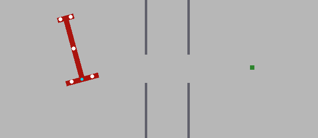
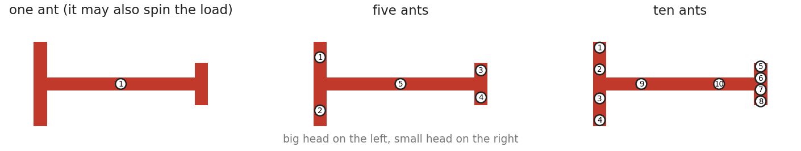
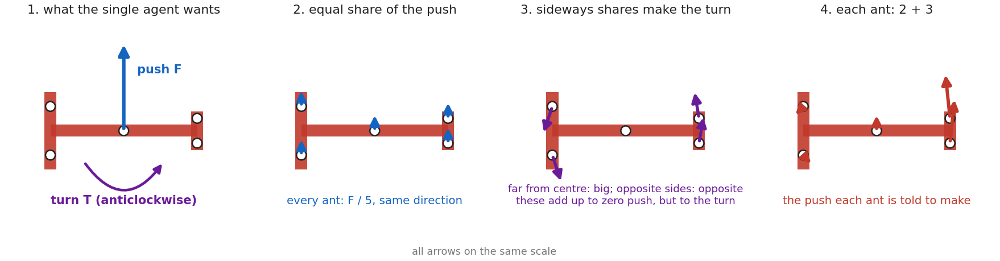
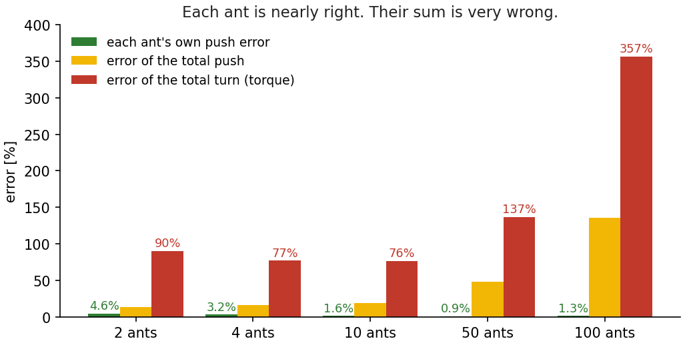
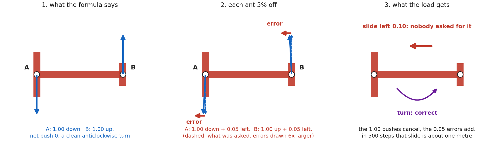
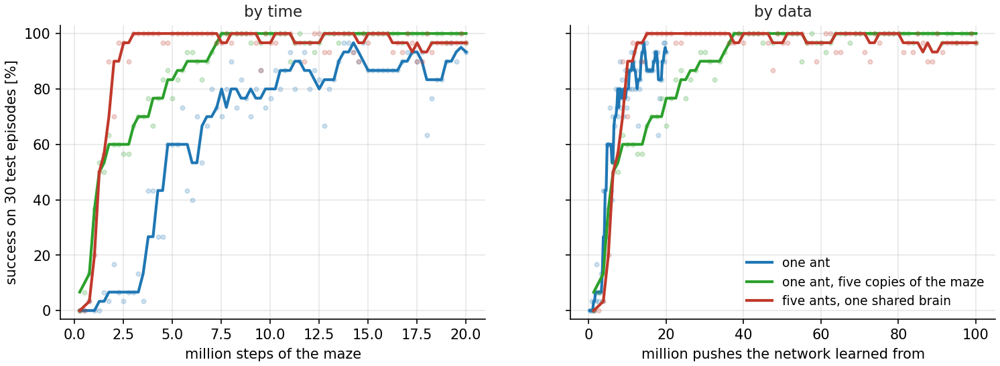
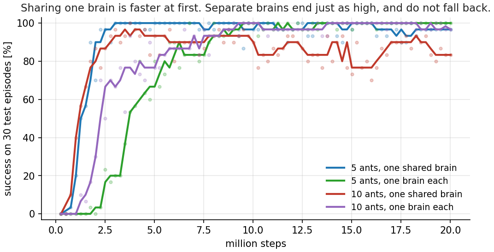
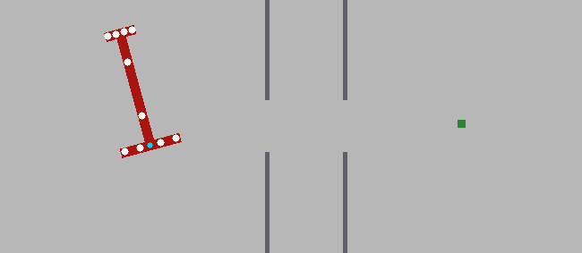
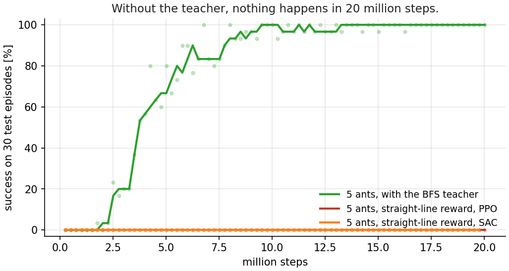

# Can multiple AI agents solve the piano-movers puzzle together?

This is part two. The puzzle comes from a real experiment
with ants. A T-shaped load has to go from one room, through a narrow slit,
into a short corridor, and out through a second slit into the goal room. The
big head of the T does not fit through a slit straight on. So the load has to
go in big head first, tilted, turn inside the corridor, and come out small
head first. Real ants do this together, dozens of them, with no leader.

In [part one](https://rezakakooee.github.io/ant-piano-movers-rl/) one AI
agent learned this maneuver with reinforcement learning. In this post the
load is carried by five, then ten, agents. Each one pushes at its own point,
sees only its own small view, and never talks to the others. The task is
also harder than in part one: the load starts anywhere in the first room, at
any angle, and the goal is drawn anywhere in the last room.

The post follows the work in order: five failed attempts, one measurement
that explained them, the fixes, and then three results I did not expect.

## 1. Where we left off

In the [first post](https://rezakakooee.github.io/ant-piano-movers-rl/) one
agent learned to carry a T-shaped load through two narrow slits. It needed a
teacher: a map of the maze, flooded backwards from the goal with BFS, that
told the agent which way is really forward. With that, it solved the maze
every time, big head first, exactly like the ants.

But the ants do not do it alone. Dozens of them hold the load at the same
time. No ant is in charge. No ant sees the whole picture. Each one feels only
the piece of the load under its own feet. And the research behind the video
[Dreyer et al., PNAS 2025] found something strange: ants get **better** in
bigger groups. People get worse.

So the next question was obvious. Can a group of AI agents do the same?

This is where the post ends up. Let me tell you how it got there. It took
five failures first.

## 2. What changes with many ants

The maze is the same. The task is harder than in post 1, in three ways.

- **Random start.** In post 1 the load always started at the same place. Now
  it starts anywhere in the start room, at any angle.
- **Random goal.** In post 1 the goal was one fixed point. Now it is drawn
  anywhere in the goal room, and the big head has to reach it.
- **No curriculum.** Post 1 trained in stages, from easy starts to the real
  start. Here there are no stages. Every episode is the full task from the
  first step of training.

The BFS teacher is still there, but only as a reward: a small reward for
every step that brings the load closer to the goal along the real route.

A random goal raises one question: a map to where? The map from post 1 was
flooded from one goal. I did not want a new map for every goal. So the
reward has two legs. The first leg uses one map, flooded from a fixed point
just past the second slit. It is the same for every goal, because every
route has to pass that point. Once the whole load is through the second
slit, the second leg takes over: plain straight-line distance to the actual
goal, which is fine in an open room. The hard part of the maze is learned
once, from one map.

And "success" everywhere in this post means: 200 fresh episodes, with start
poses and goals the ants never saw in training.

What really changes is who is holding the load.

Each ant holds one fixed point on the T. Every step, every ant chooses a
direction and a strength for its push. That is all an ant can do. It cannot
turn the load. Only the whole group can turn it, by pushing at different
points in different directions.

The one ant in post 1 was special. It sat in the middle of the load and had an
extra "spin" action, because a push from the middle can never turn anything.
The swarm has no spin. Every turn has to come from teamwork.

**What each ant sees.** This is the part I care most about. Each ant gets its
own small view: where it holds the load, where the load is, where the goal is,
how the load is moving right under its own feet, and how far the tips of the
load are from the slit corners. About thirty numbers. Nothing about the other
ants. Not even how many there are.

**What each ant decides.** All ants share one small network. It reads one
ant's view and returns that ant's push. Run it five times for five ants. Later
in the post I give every ant its own network, and we will see what changes.

There is no leader, no plan, no message. The only channel between the ants is
the load itself. When one ant pushes, the others feel the load move.

## 3. First check: is it physically possible?

Before training anything, I checked one thing. Can many small pushes even do
what one big push did?

For that I needed a single agent that can do *this* task, with a random
start and a random goal. The agent from post 1 cannot. It knew one start and
one goal. So I built a new one, and since it plays the teacher for the rest
of this post, here is what it is made of.

- **A planner.** The BFS map from post 1 gives every pose of the load a
  distance to the goal along the real route. A planner that always steps to
  a lower distance walks the load through the maze. It is not a policy, it
  is a search, and it needs the map. I ran it from 34,777 random starts to
  random goals and recorded every step.
- **A single-agent brain.** A network trained to copy those recordings.
  Given the load's pose, its speed and the goal, it outputs one push and one
  turn for the whole load. It does not need the map any more. On its own it
  solves 88 to 95% of fresh episodes.
- **The formula**, which comes next. It takes the brain's one push and one
  turn and divides them among N ants.

Brain plus formula is the teacher. I took its push and split it across N
ants.

Here is the formula in words. The single agent produces two things each step:
a push (a direction and a strength) and a turn. Now N ants have to produce the
same push and the same turn together, each one pushing at its own point on
the T.

- **The push is easy.** Give every ant an equal share: the total push divided
  by N. All ants push the same way, and the shares add up to the total.
- **The turn is the interesting part.** A push at a point away from the
  centre also turns the load, like pushing the end of a door. So every ant
  gets a second, small push, sideways, whose size depends on how far it is
  from the centre. Ants far from the centre push harder sideways. Ants near
  the centre barely push sideways at all. Ants on opposite sides push in
  opposite directions. These sideways pushes add up to zero push, but they
  add up to the turn.

Each ant's push is the sum of these two parts. There are many ways to split
one push and one turn among N ants. The formula picks the one with the
smallest pushes in total, so no ant works harder than it must. It has a
closed form, and I checked it against a numerical solver to machine
precision.

One thing to notice. To compute its sideways part, an ant needs to know where
it is *relative to all the other ants*. So the formula is centralised. It
knows where everyone holds. That is fine for a check, and fine for a teacher
at training time. It is not what the ants do.

| Ants | Success |
|---|---|
| 1 | 95% |
| 10 | 95% |
| 50 | 95% |
| 100 | 95% |

Identical, to the last decimal. Even 100 ants can copy the single agent
exactly. So the physics is fine. If the swarm fails, it fails at learning.

## 4. Five failures

Then I tried to make the ants learn. I tried five things. All five scored
zero.

The first three are **imitation**. The formula from section 3 knows the right
push for every ant in every situation. So I recorded thousands of situations,
asked the formula for the right pushes, and trained the ants to copy them.
Each ant sees only its own view and has to output its own push.

1. **Copy the push directly.** The network outputs the push itself: a
   direction and a strength. The simplest possible version.
2. **Copy two numbers instead.** The formula builds every push from two
   shared parts: a share of the total push, which is the same for every ant,
   and a share of the total turn, which depends on where the ant holds the
   load. So the network outputs those two numbers, and the push is computed
   from them. The idea was that two numbers are easier to learn than a
   direction and a strength.
3. **The same, on a log scale.** The turn share is tiny for ants near the
   middle and large for ants at the ends. A plain error measure ignores the
   tiny ones. A log scale treats a 10% mistake the same whether the value
   is small or large.

The last two are **reinforcement learning**. No formula, no copying. The
ants try pushes, get a reward, and keep what worked. This is multi-agent
PPO: one shared network, one ant's view in, one ant's push out, and one
reward for the whole team.

4. **Reward only for success.** One point when the load reaches the goal,
   zero the rest of the time. The same reward that failed for one agent in
   post 1.
5. **The BFS reward.** The teacher's reward from post 1: a small reward every
   step for moving closer to the goal along the real route. This is what
   solved the single-agent task.

| Attempt | Kind | Success |
|---|---|---|
| 1. Copy the push directly | imitation | 0% |
| 2. Copy two numbers | imitation | 0% |
| 3. Two numbers, log scale | imitation | 0% |
| 4. PPO, reward only for success | RL | 0% |
| 5. PPO, BFS reward | RL | 0% |

I also tried the curriculum from post 1 with five ants: start near the goal,
move the start back stage by stage. Sixteen stages. The ants mastered the
first one and then sat at the second for five million steps. On the real
task: zero. So the curriculum does not rescue the swarm either.

The strange thing was the first three. The ants were learning the teacher's
pushes almost perfectly. The training error was tiny. Each ant was one to five
percent off. And the load went nowhere.

How can a few percent per ant add up to nothing? The next section is the
answer.

## 5. The obstacle, measured

So I stopped training and started measuring. I let the ants push along the
teacher's own route and compared, at every step, what the ants pushed with
what the teacher wanted.

Look at the red bars. Each ant is a few percent wrong. The **turn** they make
together is 90% wrong with two ants, and 357% wrong with a hundred.

Here is why. Look back at the split figure. Each ant's push has two parts: a
big part that moves the load, and a small sideways part that turns it. The
sideways parts of ants on opposite sides point in opposite directions. As
pushes they cancel. As a turn they add up.

An ant's error is a few percent of its *whole* push. But the turning part is
only a small piece of that push. So a 3% error on the whole push can be a 30%
error on the turning part. And when you add the ants up, the turning parts
cancel, but the errors do not. Each ant's error is its own. They pile up.

A two-ant example, with numbers. Two ants at the ends of the T. The formula
says: ant A pushes down with 1.00, ant B pushes up with 1.00. Net push zero,
and a clean turn. Now each ant is 5% off. A pushes 1.00 down and 0.05 to the
left. B pushes 1.00 up and 0.05 to the left. The turn is still right. But
the load also slides left with 0.10, which nobody asked for. Over 500 steps
that slide is about one metre, in a maze 1.65 m wide. The load misses the
slit.

The signal cancels, the noise survives. That is the whole obstacle.

This is not a learning problem in the usual sense. The loss said the ants
were good. The load said they were not. Only the load was right.

There was one more thing I measured. Can an ant tell how many others are
holding the load? I trained a small probe on one ant's view. It guessed the
group size correctly 93% of the time. The load moves slower with more ants,
and the ant can feel that. So the ants have the information. Adding up their
pushes is what breaks.

## 6. Three fixes, and the first success

The measurement told me what to fix. It took two rounds.

**Round one: a teacher that hands out pushes.** The three imitation attempts
in section 4 all worked the same way. Let the teacher drive the load through
the maze, record what each ant should push at every step, and train the ants
to copy it. That is plain behaviour cloning, and it gave zero.

Here is the problem with it. The ants only ever saw the teacher's own
episodes: clean, correct routes. A student that is 3% wrong drifts a little
off that route on its first steps. Now it is in a situation the teacher
never showed it, so it is more wrong there. It drifts further. After fifty
steps it is somewhere the training data never covered, and the load is
against a wall. The small error compounds, and no amount of extra teacher
episodes fixes it, because the teacher never makes those mistakes.

The fix is called DAgger, and it is simple. Let the **students** drive. Record
the situations they get themselves into, mistakes and all. Then ask the
teacher: in each of these situations, what should each ant have pushed? Add
those answers to the training data and retrain. Repeat. Every round, the
ants get corrections for exactly the situations they actually end up in.

It climbed round by round:

| round | 0 | 2 | 4 | 7 | 10 | 11 | 15 |
|---|---|---|---|---|---|---|---|
| success | 0% | 16% | 46% | 60% | 70% | 84% | 92% |

The teacher itself scores 93% on the same episodes, so at round 15 the
students had caught up with it. Two details mattered along the way:

- **A short memory.** Giving each ant its last four views instead of one
  made a big difference early: 73% against 43% at round 8. A single view
  does not show how the load is moving. Four views do.
- **Where the ants hold.** My first layout had put all five ants on the big
  head by chance. Spreading them out, two on each head and one in the
  middle, made the turn much easier and the learning much faster: 82% by
  round 3 instead of 28%.

That gave the first non-zero result: **91%** on 200 fresh episodes. Five ants,
each seeing only its own view. A small victory, but a borrowed one. It
needed the formula, and the formula needs to know where all the ants are.

My first idea was to improve the 91% with RL. Take the copied policy, keep
training it with PPO, let it find what the teacher could not show it. That
went badly. Without something holding it near the teacher, PPO took an 87%
policy to 0% in a few million steps. With a leash, a penalty for moving away
from the teacher's pushes, it ended at 84%. Lower than where it started. RL
on top of a good policy did not add anything here. It only took away.

**Round two: pure learning, no formula.** I wanted the ants to find the pushes
themselves. Looking at what works in the literature on this kind of task, my
setup was missing three things:

1. **A judge that sees everyone.** In PPO there is a second network that
   judges how good a situation is. Mine looked at one ant's view. That is a
   judge who cannot see the other players. Now it sees all ants' views at
   once. Only the judge is shared. Each ant still acts on its own view.
2. **Feel the load under your own feet.** The ants' view had the load's speed
   at its centre. It did not have the speed at the point where the ant is
   holding. That is the one thing the ants really communicate through. I
   added it.
3. **Thirty workers that were one worker.** This one was a bug, and an ugly
   one. Training ran on thirty parallel copies of the maze. All thirty had
   the same random seed. So I had one experience copied thirty times. The
   "too good" training error from section 4 was the tell.

With those three, and nothing else, pure multi-agent RL learned the maze.
Five ants, from zero, no formula, no demonstrations.

Not on the first try, though. The first run sat at zero for twelve million
steps, then crept up to 30%, and stayed there for another twenty million. I
was ready to write "pure RL gets you 30%". Then I changed one thing, the
random seed, and the next run reached 96%. Same code, same settings. I do
not have a good explanation. I do have a rule now: never quote a number from
one run. More on that at the end.

## 7. A fair fight: one ant against five

Now I could ask the question from the top of the post. Does the group do
better than one?

Same maze, same reward, same network size, same random seed, same twenty
million steps of training. The only difference is the `ants` line in the
config file. One ant in the middle, with its spin. Or five ants, spread over
the T, with no spin.

| | Success on 200 fresh episodes |
|---|---|
| One ant | 88% |
| Five ants | **96%** |

The swarm learned faster, and ended higher. Even though the single ant has
the easier job, with its spin action.

For about a day I believed the swarm was smarter.

## 8. Why? Data, not teamwork

Here is what I had missed. Five ants share one network. Every step of the
maze, that network sees five views and learns from five pushes. The single
ant's network sees one. Same number of steps, five times the data.

So I gave the single ant five times the data too. Each training worker now
runs five copies of the maze instead of one. Nothing else changed.

Three runs. Blue: one ant, one maze. Red: five ants, one maze. Green: one
ant, five mazes. Higher is better.

**Left plot: success against training time.** Blue, the plain single ant, is
the slowest. Red and green reach the top at about the same time. So one ant
with five mazes learns as fast as five ants with one maze.

**Right plot: the same three runs, but the x-axis is data.** Instead of "how
long did it train", it asks "how many pushes did the network learn from". A
step with five ants gives five pushes, and a step with five mazes also gives
five pushes. On this axis all three lines fall on top of each other. Given
the same amount of data, one ant and five ants learn at the same speed.

| | Success on 200 fresh episodes |
|---|---|
| One ant, one maze per worker | 88% |
| Five ants, one shared brain | 96% |
| One ant, five mazes per worker | **100%** |

With the same amount of data, one ant beats the swarm. The swarm's advantage
was not cooperation. It was five samples per step.

One thing this does not say: that the swarm has no advantage at all. Early in
training, at equal data and equal updates, the swarm is still ahead: 93%
against 80% after three million steps. Five pushes at five points move the load in more
useful ways than one push and a spin. That head start is real. But by the
end it is gone.

This is the lesson of the post, if there is one. **Before you believe a swarm
is smarter, count its samples.**

## 9. Ten ants, and one brain per ant

The ants in the PNAS paper get better in bigger groups. Do mine?

I doubled the group to ten ants, four on each head and two on the stem. Same
recipe. It started as fast as five ants. Then something new happened. It
reached 94%, and slid back down. At the end of training it was at 80%.

Looking inside, the ten ants had learned to push softer and softer, and their
pushes had become almost deterministic. Each ant's share of the turn is
smaller with ten ants, and section 5 told us that summed errors grow with the
group size. A policy that no longer explores cannot climb back out.

Then I tried the thing I had been curious about since the start. **Give every
ant its own brain.** No shared network. Each ant gets its own network, its
own random start, and even a slightly different shape: a little wider or
narrower, a different activation function. Five different brains, or ten.

Two things happened.

First, separate brains learn **slower**. Of course they do. Each brain now
sees one view per step instead of five. Section 8 again.

Second, they end **just as high, and they do not slide back**.

| Swarm | Success on 200 fresh episodes |
|---|---|
| 5 ants, one shared brain | 96% |
| 5 ants, one brain each | **98%** |
| 10 ants, one shared brain | 80% (peak 94%) |
| 10 ants, one brain each | **94%** |

Ten different networks, that never share a weight and never send a message,
carry the load through the maze together. The only thing they have in common
is the load under their feet. That was enough.

So do my ants get better in bigger groups, like the real ones? Not yet. Ten
is not better than five. But ten is not worse either, once every ant has its
own brain. And I did not tune anything for ten.

## 10. The one thing that still matters: the teacher

Every run above used the BFS teacher from post 1. Not as a curriculum this
time, only as the reward: a small reward for every step that brings the load
closer to the goal *along the real route*.

In post 1, one agent without that teacher never passed the second slit. Not
with a shaped reward, not with hindsight replay, not with exploration
bonuses, not with Go-Explore. I wanted to know: does a swarm change that?

So I took the teacher away. The reward became the plain straight-line
distance to the goal, plus the success bonus. Five ants, each with its own
brain, twenty million steps. I ran it with PPO. Then I ran it with SAC, with
the same two-pool trick from post 1 that keeps rare successes from being
forgotten.

Zero. Both. Not one success in forty million steps. The success pool in the
SAC run never received a single episode, because there never was one.

The picture is the same as in post 1. The ants bring the load to the first
slit and push it into the wall, because that is where the straight line to
the goal goes. Nothing ever tells them to turn away and go around.

Five ants do not explore their way through. More pushes at more points do
help, but only when there is a signal that says which motion was progress.
Without the map, there is none.

## 11. What I learned

Six things, from a month with the swarm.

1. **A swarm of five or ten ants can solve the maze.** Each ant sees only its
   own small view. No leader, no message, no map at test time, no ant count.
2. **The five failures were bugs, not algorithms.** A judge that saw one
   player. A view without the load's motion at the ant's feet. Thirty
   workers that were one. Each was measured before it was fixed.
3. **The swarm's speed was data, not teamwork.** Give one ant the same data
   and it wins, 100% to 96%.
4. **Sharing a brain is optional.** Ten different brains, no shared weights,
   cooperate fine. They learn slower and do not collapse.
5. **The BFS teacher is the one thing nothing replaces.** With it, every
   recipe works. Without it, nothing crosses the second slit. Not one agent,
   not five, not PPO, not SAC.
6. **Test on episodes the agent never saw.** Several numbers in this post
   were higher on the training evaluation. 98% became 91%. 100% became 85%.
   Every number here comes from 200 fresh episodes.

## 12. What stays open

Three things I did not solve.

**A new grip.** Every swarm was trained with the ants at fixed points on the
T. Move the ants to different points, and the success rate is zero. The ants
learned the maze for their own grip, not for any grip. Real ants regrip all
the time.

**Learning without the map.** Post 1 and section 10 of this post say the
same thing. Something has to tell the agents that turning
away from the goal is progress. I do not know yet how to do that without a
map of the maze.

**One seed.** Every number in this post is one training run. An earlier run
of the five-ant swarm, with a different seed, got 30%. The recipe is
sensitive. Three seeds per number is the right next step.

## Come and play with it

Everything is on GitHub, and it is open:

**[github.com/RezaKakooee/ant-piano-movers-rl](https://github.com/RezaKakooee/ant-piano-movers-rl)**

The environment, the multi-agent trainer, the SAC version with the two
pools, the ten-ant config, and the scripts that made every figure in this
post.

If you find a way through the maze without a map, or a swarm that gets
better with size the way real ants do, I would love to hear about it. Open an
issue, or write to me. And if you work on collective behaviour or multi-agent
RL, please get in touch.
