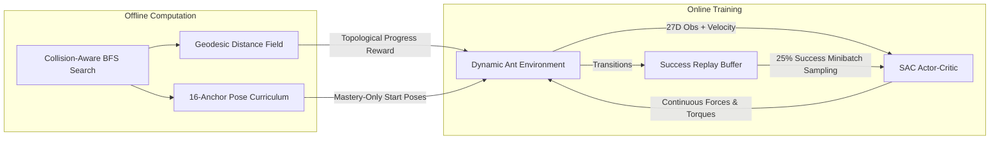

# Moving a Piano Through a Needle’s Eye: Solving Complex Ant Navigation with Reinforcement Learning

*How combining geodesic potential shaping, reverse pose curricula, and success-prioritized SAC solved the classic PNAS "piano-movers" problem in continuous dynamic physics.*

---

## 1. Motivation: Nature’s Ultimate Movers

Anyone who has tried to maneuver a bulky sofa through a narrow hallway knows the frustration of the **"Piano-Movers Problem"**. A single wrong angle wedges the object against the doorframe, requiring backtracking, rotation, and precise realignment.

In nature, crazy ants (*Paratrechina longicornis*) perform these feats cooperatively with astonishing ease. In a landmark study published in **PNAS (Dreyer et al., 2025)**, researchers challenged ants to transport an asymmetric **T-shaped load** through a two-barrier obstacle maze with a tight middle chamber.

```
                  ┌─────────────────────────────────────┐
                  │    Wall 1                 Wall 2    │
                  │      │                      │       │
    Start         │      │       Chamber        │       │    Goal
  [T-Shape] ─────►│      ▼                      ▼       │───► (X)
 (x=0.3, y=0.36)  │    Slit 1                 Slit 2    │ (x=1.2, y=0.36)
  Heading: 180°   │  (Enter BIG)           (Exit SMALL) │
                  └─────────────────────────────────────┘
```

To solve the puzzle, the load must follow a counter-intuitive topological sequence:
1. **Enter Slit 1 with the BIG head first.**
2. **Rotate the load $180^\circ$ inside the narrow middle chamber.**
3. **Exit Slit 2 with the SMALL head first.**

We set out to study this benchmark in continuous dynamic physics. To make the learning mechanics crystal clear, we ran **two contrasting experiments**: an **Easy Task** (wide opening, no curriculum needed) and the **Canonical Hard Task** (tight opening, full recipe required).

---

## 2. A Tale of Two Mazes: Easy vs. Hard

```
EASY TASK (Gap = 0.32m):                    CANONICAL HARD TASK (Gap = 0.15m):
Wide openings allow direct passage.         Tight slits require strict Big-First -> Chamber Turn -> Small-First.

   ┌──────┐      ┌──────┐                      ┌──────┐      ┌──────┐
   │ Wall │      │ Wall │                      │ Wall │      │ Wall │
   │      │      │      │                      │  │   │      │  │   │
───┤      ├──────┤      ├───► (Goal)       ───►│  ▼   │──────│  ▼   ├───► (Goal)
   │ (0.32m gap) │(0.32m gap)                  │(0.15m)│ (Chamber)│(0.15m)│
   │      │      │      │                      │Slit 1│      │Slit 2│
   │ Wall │      │ Wall │                      │ Wall │      │ Wall │
   └──────┘      └──────┘                      └──────┘      └──────┘
```

### Side-by-Side Comparison

| Dimension | Easy Task (`pnas_dyn_geo_easy.yaml`) | Hard Task (`pnas_dyn_geo_v2.yaml`) |
| :--- | :--- | :--- |
| **Wall Opening (Gap)** | **$0.32\,\text{m}$** (wide clearance) | **$0.15\,\text{m}$** (sub-millimeter clearance) |
| **Curriculum Needed?** | **None (Disabled)** — Learns directly from start | **16-Anchor Reverse Pose-Path** (Mandatory) |
| **Steps to Master** | **~25,000 steps** ($< 10$ minutes) | **247,519 steps** (~2 hours) |
| **Episode Length** | **54 steps** (straight-line drive) | **153 steps** (complex 3-phase maneuver) |
| **Maneuver Required** | Push straight through wide openings | Align $\to$ Big-First Slit 1 $\to$ $180^\circ$ Chamber Pivot $\to$ Small-First Slit 2 |

---

## 3. Experiment 1: The Easy Task (Direct RL Without Curriculum)

When the opening is widened to $0.32\,\text{m}$, the clearance is wider than the T-bar's big head ($0.175\,\text{m}$) and stem. 

In this regime:
- The agent does **not** need a curriculum. Starting directly from the full start pose ($x=0.30, y=0.36, \theta=\pi$), the agent discovers the passage through random exploration within 5,000 steps.
- Within **25,000 steps**, the Soft Actor-Critic policy reaches a **100% success rate**, navigating from start to goal in just **54 steps**.


*The agent drives the T-load directly through both wide openings with minimal rotational adjustment.*

---

## 4. Experiment 2: Why the Hard Task Breaks Standard RL

When we shrink the gap to the canonical paper dimension (**$0.15\,\text{m}$**), direct RL fails completely ($0\%$ success rate). Why?

### 1. The Dimensional Bottleneck
The big head is $0.175\,\text{m}$ wide. Because $0.175\,\text{m} > 0.150\,\text{m}$, the load **physically cannot rotate inside the slit**. It can only pass through if aligned with surgical precision.

### 2. Deceptive Euclidean Distance (Local Minima)
Standard Euclidean distance reward ($r = -\|\mathbf{x} - \mathbf{x}_{\text{goal}}\|$) pulls the load directly towards the goal. This causes the agent to ram into the dividing wall or try forcing the small head in first, where it gets permanently wedged.

### 3. Continuous Dynamic Momentum & Friction
Unlike grid worlds, the environment simulates mass ($0.5\,\text{kg}$), angular inertia, friction ($0.96$), and momentum. Pushing too fast causes inertial overshoot and wall collisions.

---

## 5. The Solution: Our 4-Part RL Recipe

To conquer the canonical hard task, we developed a principled RL pipeline:



### A. 27D Full-Observability State Vector
We include load coordinates, goal vectors, trigonometric orientation $(\sin\theta, \cos\theta)$, and critically:
$$\mathbf{v}_{\text{world}} = (v_x, v_y)$$
World-frame linear velocity eliminates partial observability under momentum, enabling the policy to brake and counter inertial drift.

### B. Geodesic Potential Shaping
We compute an offline **collision-aware Breadth-First Search (BFS)** over the 3D configuration space $(x, y, \theta)$ with a 2mm safety inflation margin.
$$r_t = \Phi(s_t) - \Phi(s_{t-1}) + R_{\text{terminal}}$$
where $\Phi(s) = -D_{\text{geodesic}}(x, y, \theta)$ tracks the shortest valid path of the **big-cap centre**. Moving along the true topological corridor rewards the agent; hitting dead ends yields zero progress.

### C. Exact Pose-Path Reverse Curriculum
> [!WARNING]
> **Why not widen the walls during training?**  
> Gap annealing causes severe **negative transfer**: in a wider gap, the policy learns a "pirouette shortcut" (poking the small head in first), which fails when walls are narrowed.

Instead, we keep the maze at **full canonical difficulty** and place **16 discrete anchors** along the BFS solution route from the goal (Stage 0) backward to the start (Stage 15).
- **Mastery-Only Advancement**: A stage advances only when rolling success $\ge 90\%$ over 100 episodes. Elapsed time never promotes an unmastered stage.

### D. Success-Prioritized Replay Buffer
Every completed success is retained in a dedicated buffer. During minibatch training, **25% of every batch (64 / 256)** is sampled from verified successes, preventing catastrophic forgetting of the narrow slit passage.

---

## 6. Hard Task Results: Mastered in 153 Steps

The policy mastered all 16 stages in **247,519 steps**, achieving a **100% full-task success rate**.


*The policy executes the full 3-phase sequence: Big-first entry $\to$ $180^\circ$ chamber spin $\to$ Small-first exit.*

### Detailed Performance Breakdown

| Metric | Easy Task (Direct SAC) | Canonical Hard Task (Full Recipe) |
| :--- | :--- | :--- |
| **Deterministic Success** | **100.0%** (5 / 5) | **100.0%** (5 / 5) |
| **Stochastic Success** | **100.0%** (3 / 3) | **100.0%** (3 / 3) |
| **Average Episode Steps** | **54.0 steps** | **153.0 steps** |
| **Final Goal Distance** | **0.046 m** | **0.057 m** ($< 0.06\,\text{m}$ threshold) |
| **Training Steps** | **~25,000 steps** | **247,519 steps** |

---

## 7. Educational Takeaways

1. **Curriculum is necessary only when exploration bottlenecks exist**: Wide passages can be solved directly by standard RL, but tight geometric constraints require structured support.
2. **Never modify environment geometry if it changes the optimal policy topology**: Use reverse pose-path curricula instead of gap annealing to avoid negative transfer.
3. **Geodesic potential shaping breaks deceptive local minima**: In constrained mazes, topological distance is the only metric that consistently points toward the goal.
4. **Buffer sample prioritization protects rare bottlenecks**: Forcing 25% success transitions in replay minibatches prevents regression on delicate maneuvers.

---

## Next Up: Multi-Agent Swarms
Now that single-agent dynamic navigation is solved for both easy and canonical PNAS mazes, the next step is **multi-agent cooperative transport**: coordinating multiple decentralized ants ($N \ge 2$) pushing the T-load together through the same narrow slits.
