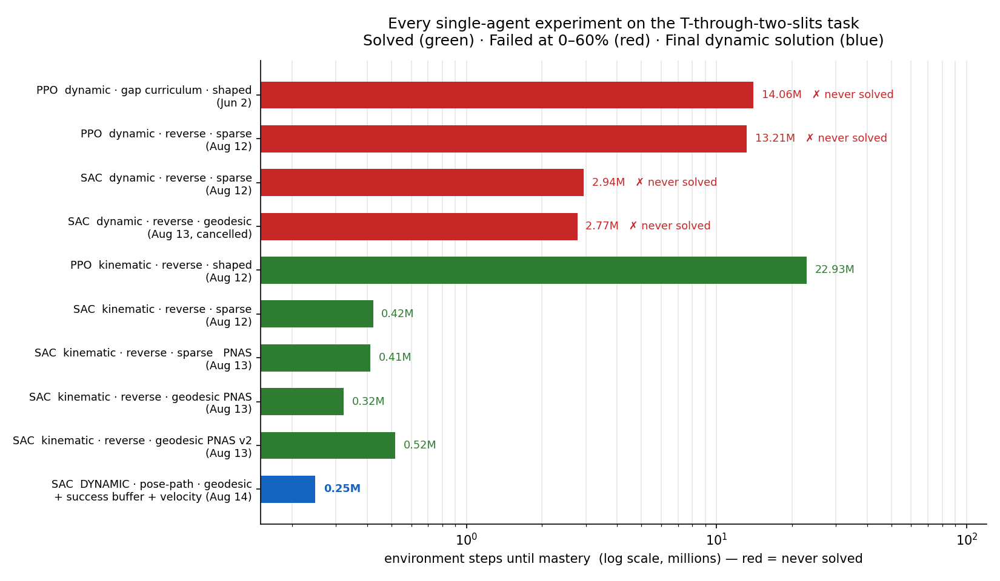

# Moving a Piano Through a Needle's Eye

**How we taught a single agent to solve the ants' piano-movers puzzle — after
three months of failures.**

*The short version: the task took ~14 million steps and still failed. Then it
took 247,519 steps and worked perfectly. This post is about what changed.*



*Every single-agent experiment we ran. Red = never solved. The last bar is the
one that worked.*

---

## 1. The problem

A T-shaped load must cross a box divided into three chambers. Two walls
separate them. Each wall has one narrow slit.

```
   chamber 1          chamber 2          chamber 3
  ┌───────────┬────┐ ┌────┬───────────┐
  │           │    │ │    │           │
  │   [T]     ▼    │ │    ▼      (goal)
  │         slit 1 │ │  slit 2       │
  └───────────┴────┘ └────┴───────────┘
```

The numbers are what make it hard:

| Part | Size |
|---|---|
| Slit opening (gap) | **0.150** |
| T big head | **0.175** |
| T small head | 0.087 |
| T total length | 0.359 |
| Chamber 2 depth | 0.221 |

The big head (0.175) is **wider than the slit** (0.150). So you cannot push the
T straight through. You must tilt it and thread it.

And chamber 2 is shallower (0.221) than the T is long (0.359). So you cannot
freely turn the T inside the middle chamber either.

Only one family of solutions survives:

1. Enter slit 1 with the **big head first**.
2. Turn inside the middle chamber, using both slits as space.
3. Exit slit 2 with the **small head first**.

This is a classic **piano-movers problem**: not "where do I go", but "in which
order do I rotate and translate".

## 2. Why we care: the ants

This is not a made-up puzzle. It is a copy of a real experiment.

In **Dreyer et al., PNAS 2025**, the Feinerman lab gave exactly this maze to
longhorn crazy ants (*Paratrechina longicornis*) and to groups of humans. The
ants solved it — and, unlike the humans, they got **better** in larger groups.
No single ant understands the maze. Each ant just pulls at its attachment
point, and the group behaviour produces the maneuver.

We rebuilt this maze as a gym environment. We took the dimensions from the
paper's SI Table S1 and measured the rest from the experiment videos. The
long-term goal is the interesting one: **many agents pushing one load**, like
real ants.

But before running, walk. One agent must be able to solve the maze at all.
That is this post.

## 3. How the environment is built

### The world

Pure Python/NumPy, no physics engine. World 1.65 × 0.72. Walls at x = 0.758 and
x = 0.979, thickness 0.01. Goal at (1.2, 0.36), reach radius 0.06.

Collision is exact: every part of the T is an oriented rectangle, tested
against the walls with the separating-axis test.

### Action — two motion modes

**Kinematic** (simple): one command for the whole T.

```
action = [direction ∈ [-π, π],  rotation ∈ [-1, 1]]
```
Each step the T moves 0.01 along `direction` and turns `0.1 · rotation`.
No mass, no momentum. If a move collides, it is rejected (the T slides along
the wall instead of passing through).

**Dynamic** (the real thing, closest to ants): each ant applies a **force** at
its attachment point.

```
action per ant = [push angle,  magnitude]     (+ spin, for a single agent)
```
Forces are summed into force + torque. The load has mass 0.5, inertia 0.01,
linear friction 0.96, angular friction 0.94, and 10 substeps per env step. The
load carries **momentum** — it drifts, overshoots, and bounces.

A single agent sits at the centre of the stem, so its force alone makes no
torque. That is why it gets a third action, `spin` (direct torque).

### Observation

Per ant, 25 numbers (later 27):

| Block | Numbers | Meaning |
|---|---|---|
| Attachment offset | 2 | where this ant sits on the T |
| T centre | 2 | position in the world |
| Goal vector | 2 | goal minus the tracked point |
| Orientation | 2 | sin θ, cos θ |
| Angular velocity | 1 | how fast it spins |
| **Linear velocity** | **2** | **added later — see section 8** |
| Tip → wall-head distances | 16 | 4 arm tips × 4 slit corners |

That last block matters. Early policies never rotated near the slit, because
the walls were not in the observation at all. Those 16 distances give a sharp
"an arm is about to clip a corner" signal.

### Reward

Three modes, and the story of this project is mostly the story of this choice:

- **sparse**: `+1.0` when the tracked point reaches the goal. Otherwise `0`.
- **shaped**: sparse `+` `0.1 × (previous distance − current distance)`.
- **geodesic**: shaped, but with the *right* distance (section 7).

One important detail: distance is measured **from the big-cap centre**, not the
T centre (`env.goal_track: big_cap`). Section 5 explains why.

### Network and algorithm

Nothing exotic — the difficulty is not in the model:

- **SAC** (Soft Actor-Critic), MLP policy `[256, 256]`, automatic entropy tuning.
- Also tested: **PPO** (8 parallel envs, gSDE, entropy annealing).
- γ = 0.99, episode limit 500 steps.

SAC is off-policy, so it reuses every transition — important when successes are
rare. In our results SAC beat PPO by roughly **50× in sample efficiency**.

## 4. First attempt: single agent, no curriculum

We started the honest way: put the agent in the maze and train.

**Random policy:** 0% success. The T wanders in chamber 1 for the full 500
steps, every episode.

**PPO, dynamic physics, shaped reward, 14 million steps:** still 0%.


*PPO after 14 million steps. It has learned exactly one thing: drive at the
goal. It pushes the T against the wall and stays there.*

We tried the obvious variations. All of them failed:

| Run | Steps | Result |
|---|---|---|
| PPO dynamic, gap curriculum, shaped | 14.06M | 0% |
| PPO dynamic, reverse curriculum, sparse | 13.21M | 0% |
| SAC dynamic, reverse curriculum, sparse | 2.94M | 0% |
| SAC dynamic, reverse curriculum, geodesic | 2.77M | stuck at 60% |

## 5. Why it did not work

Four separate reasons, and each one had to be fixed on its own.

### (a) The reward is sparse

The agent only gets a signal when it **finishes**. Before that, everything
looks identical: reward 0. There is nothing to climb.

### (b) The solution space is tiny

We measured this directly. We built the space of all possible poses
(x, y, angle) on a grid and marked which ones are collision-free:

- Only **~30%** of all poses are legal at all.
- The passage through a slit is a **thin diagonal channel** in that space.
- Its clearance is about **2.5 mm**. If we make the walls 3 mm thicker, the maze
  becomes **impossible**.

So random exploration must find a few-millimetre channel, in a 3-D pose space,
by chance, and then follow it for ~150 steps in the right order. It never
happens. This is a textbook **exploration bottleneck**.

### (c) The distance reward lies

The natural fix for a sparse reward is to reward getting closer to the goal.
Here that makes things **worse**.

Straight-line distance pulls the T at the wall. The correct maneuver — tilting
and backing up to align the big head — *increases* the straight-line distance.
So the shaping reward actively **punishes the correct move**. This is a
**deceptive reward**, not just a weak one.

### (d) The agent found a cheat

Our first "successful" runs were a trap. With distance measured from the T
centre, the agent learned to poke the **small head** through the slits, because
the small head fits anywhere. It scored well and never learned the real
maneuver.

**Fix:** measure the distance from the **big-cap centre**. Now the big head
must reach the goal, so leading with the small end earns nothing. The cheat
disappeared — and success rates dropped back to 0%, which was the honest number
all along.

## 6. What did work: start from the end (reverse curriculum)

The failing part is exploration, not learning. So do not make the maze easier —
make the **starting position** easier.

> **Important:** we do NOT widen the slits. A wider slit is not "the same task,
> easier". It is a **different task** with different solutions: in a wide slit
> the small-head-first trick works. Train on that and the skill does not
> transfer back. This is **negative transfer**, and we measured it.

Instead the maze stays at full difficulty, and only the **spawn point** moves:

1. Stage 0: the T starts almost at the goal. Success is easy, and the agent
   sees a reward at all.
2. When success ≥ 70–90%, the start moves one step backwards.
3. Repeat until the start is the real start.

Evaluation always uses the true full task, so the numbers never lie to us.

This immediately solved the **kinematic** version (no momentum):

| First success (step 1,403) | After mastery (step 421,814) |
|---|---|
|  |  |
| Lucky wandering, 403 steps, started next to the goal | The real task, 79 steps, near optimal |

SAC reached 99% in **422k steps**. PPO also solved it — but needed 22.9M steps.

## 7. Making the reward tell the truth (geodesic + BFS)

The distance reward was deceptive because it used the **wrong distance**.
Straight-line distance goes through walls. The T cannot.

So we replaced it with the distance **along the real route**.

**How we compute it, once, offline:**

1. Take the space of all poses (x, y, θ) on a fine grid.
2. Mark which poses are collision-free (with 2 mm of safety margin).
3. Run **BFS** (breadth-first search) from the goal, spreading only through
   free poses. Neighbours = one small move or one small rotation.
4. Every pose now carries a number: "how many legal small moves to the goal".

That is the **geodesic distance field**. Then:

```
reward = field(previous pose) − field(new pose)      + success bonus
```

Now the reward tells the truth:

- Turning in place to align the big head → the field number **drops** →
  positive reward. **Turning is progress.**
- Backing away from the goal to line up → still positive, if it is on the route.
- Poking the small head into the dead end → the number **jumps up** → negative.
  **The trap punishes itself.**

It is potential-based shaping, so it cannot change which policy is optimal — it
only makes the good one easier to find. In practice it gave ~25% faster mastery
than sparse reward on the kinematic maze (322k vs 411k steps).

**A caution we learned the hard way.** Even with the correct geometry, the
kinematic policy found a legal-but-unwanted trick: poke the small head in, then
pirouette inside the slit. In the real experiment, 3-D covers prevent it.

| The maneuver we want | The trick the agent found |
|---|---|
|  |  |
| Big head enters slit 1, turn, small head exits | Small head pokes in, then spins inside the slit |

Narrowing the gap from 0.16 to 0.15 (the exact paper value) reduced this from
half of all solutions to about a third. The full fix came next.

## 8. The last three changes — and dynamic physics falls

Kinematic was solved. **Dynamic** — with real forces and momentum — still was
not. Three changes finished it.

### (a) Pose-path curriculum: put the stages ON the solution

Before, a stage was "start somewhere in this x-band". Many of those random
starts were bad: impossible, or already touching a wall.

We already had the BFS route from the reward field. So we used it twice: take
**16 points along the true solution path** and make those the curriculum
stages. Every stage now starts exactly on the correct route, just further back
than the last one. A stage advances **only** on real mastery (≥90% over 100
episodes) — never because time ran out.

This is also what finally killed the pirouette: the agent only ever practises
the canonical route.

### (b) Success replay buffer: do not forget the rare win

SAC learns from a big pool of past experience. Wins through the slit are rare,
so they drown in that pool and get forgotten.

Fix: keep successful episodes in a **separate** pool, and force **25% of every
learning batch** to come from it. In simple words: the agent is not allowed to
forget how it passed the slit.

### (c) Let the agent feel its own speed

In dynamic mode the load has momentum. It slides, drifts, overshoots. But the
observation only had position and angle — not **speed**. That is like driving
while seeing where you are, but not how fast you are moving.

We added the linear velocity (vx, vy). Observation 25 → 27. Now the policy can
brake and correct for drift.

## 9. Result

**100% success. Mastered at 247,519 steps** — about 2 hours on one machine, and
**56× fewer steps** than the 14M-step run that learned nothing.


*Five independent evaluation episodes from the real start pose. All solved,
about 153 steps each.*

Independent check: we replayed the last 25 saved solutions and measured which
head crosses each slit first.

```
which cap crosses SLIT 1 first :  BIG   25 / 25
which cap crosses SLIT 2 first :  small 25 / 25
```

**Every single solution uses the ants' maneuver**: big head in, turn in the
middle chamber, small head out. No shortcuts, in real physics.

| | Value |
|---|---|
| Success (deterministic) | 100% (5/5) |
| Success (stochastic) | 100% (3/3) |
| Steps to master | 247,519 |
| Episode length | ~153 steps |
| Canonical maneuver | 25/25 |

## 10. What we would tell our past selves

1. **Do not make the environment easier if that changes the solution.** Easier
   slits taught a trick that does not transfer. Move the *start*, not the walls.
2. **A dense reward is only useful if it points the right way.** Straight-line
   distance was worse than nothing. The route distance (BFS) fixed it.
3. **Measure your solution space before blaming the algorithm.** "2.5 mm of
   clearance in a 3-D pose space" explains the failures better than any
   hyperparameter.
4. **Check what the agent actually did, not just its score.** Two of our
   "successes" were cheats. Replay the trajectories.
5. **Reuse the planner.** The same BFS gave us the reward field, the curriculum
   stages, and a proof that the maze is solvable.
6. **When physics has memory, the observation needs it too.** Momentum without
   velocity in the observation is a hidden state.

## Next: the ants themselves

Single agent is done, in both motion modes. The interesting part starts now:
**many agents, one load** (`ants.n ≥ 2`). First a central controller, then
parameter-shared decentralized policies where each ant sees only its own local
observation — which is the real question the ants answer every day.

---

*Environment, configs, and every run in this post:
[github.com/RezaKakooee/ant_swarm](https://github.com/RezaKakooee/ant_swarm).
Reference: Dreyer et al., "Comparing cooperative geometric puzzle solving in
ants versus humans", PNAS 2025.*
